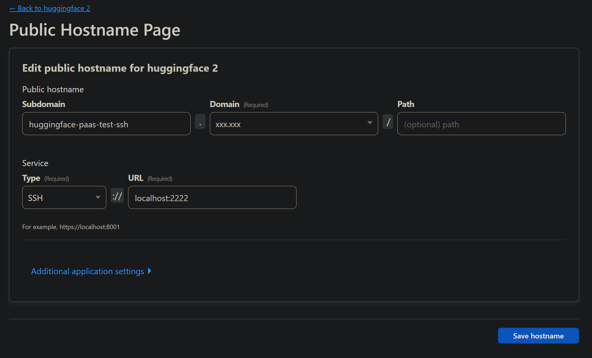

Check out the configuration reference at [https://huggingface.co/docs/hub/spaces-config-reference](https://huggingface.co/docs/hub/spaces-config-reference)

## 使用方法

下载本仓库到电脑

[https://huggingface.co/new-space](https://huggingface.co/new-space) <--创建新 space


upload files


然后上传 huggingface （一定要上传本仓库所有的文件）dockerfile 文件是必要的

## huggingface 的域名

用户名-(space 名空格会转换-).hf.space
例如：
abcdefg-image-and-3d-model-creator.hf.space
用户名 abcdefg

space 名 image-and-3d-model-creator

第二种方法查看域名:

鼠标右键点 view frame source


## 环境变量说明（更多的使用说明）

设置说明在下面链接：

[https://github.com/3Kmfi6HP/argo-airport-paas/tree/main#%E7%8E%AF%E5%A2%83%E5%8F%98%E9%87%8F%E8%AF%B4%E6%98%8E](https://github.com/3Kmfi6HP/argo-airport-paas/tree/main#%E7%8E%AF%E5%A2%83%E5%8F%98%E9%87%8F%E8%AF%B4%E6%98%8E)

有些不同的地方是：

**_环境变量 PORT 一定要设置 7860 目前已经在 dockerfies 定义 可以不用设置_**

**_cloudflared Argo 也要 7860 端口 才能连接_**

也可以直接通过 huggingface 的域名连接

如果 nezha 无法连接 请使用 443 端口

当网页显示 Hello World! 说明部署成功

## 什么都不设置方法

访问 huggingface 域名/list 就可以查看节点 临时 argo tunnel 方法

希望固定域名？

把临时的 argo 域名修改 成 huggingface 域名就能连接

## 用到的变量

|           变量名           | 是否必须 |                     默认值                     | 备注                                                                                                        |
| :------------------------: | :------: | :--------------------------------------------: | :---------------------------------------------------------------------------------------------------------- |
|            UUID            |    否    |      de04add9-5c68-8bab-950c-08cd5320df18      | 可在线生成[https://www.zxgj.cn/g/uuid](https://www.zxgj.cn/g/uuid) 或者用 V2rayN                            |
|           WSPATH           |    否    |                      argo                      | 勿以 / 开头，各协议路径为 `/WSPATH-协议`，如 `/argo-vless`,`/argo-vmess`,`/argo-trojan`,`/argo-shadowsocks` |
|            PORT            |    否    |                      3000                      | 容器默认 listen 0.0.0.0  的端口                                                                             |
|        NEZHA_SERVER        |    否    |                                                | Nezha 的服务地址                                                                                            |
|         NEZHA_PORT         |    否    |                                                | Nezha 的服务端口                                                                                            |
|         NEZHA_KEY          |    否    |                                                | Nezha 的 key                                                                                                |
|         ARGO_AUTH          |    否    |                                                | Argo 项目的认证信息 TOKEN 值                                                                                |
|        ARGO_DOMAIN         |    否    |                                                | Argo 的域名，须与 ARGO_DOMAIN 必需一起填了才能生效                                                          |
|    TARGET_HOSTNAME_URL     |    否    | [http://127.0.0.1:8081](http://127.0.0.1:8081) | 使用 v2board 时候可以自定义设置                                                                             |
|     MAX_MEMORY_RESTART     |    否    |                     128MB                      | PM2 重启时的内存阈值 限制内存使用                                                                           |
|        SSH_PUB_KEY         |    否    |                                                | 设置 Public Key 用于 ssh 连接 一般不需要设置<br />除非你需要 ssh 连接 例如  ssh-rsa AAAAB3NzaC1yc2EAAA...   |
| TUNNEL_TRANSPORT_PROTOCOL  |    否    |                      quic                      | 设置 cloudflared 传输协议<br />默认为 quic 可选 http2 <br />对于某些网络不稳定的情况可以尝试 http2          |
| **接入 v2bord 用到的变量** |    -     |                       -                        |                                                                                                             |
|          API_HOST          |    是    |                                                | v2board API 服务的域名 URL<br />格式是[https://example.com](https://example.com) \*必须                     |
|          API_KEY           |    是    |                                                | 在 v2board 获取\*必须                                                                                       |
|        CERT_DOMAIN         |    否    |                                                | example.com 域名可以顺便填 或者不填                                                                         |
|          NODE_ID           |    是    |                                                | 是 数字 在 v2board 获取\*必须                                                                               |

## 用到的路径 path

| 命令           | 说明                  |
| -------------- | --------------------- |
| `<URL>`/list   | 查看节点数据          |
| `<URL>`/status | 查看后台进程 目录权限 |
| `<URL>`/listen | 查看后台监听端口      |
| `<URL>`/test   | 测试是否为只读系统    |
| `<URL>`/ip     | 查看 IP 网络连接      |
| `<URL>`/env    | 查看系统所有环境变量  |
| `<URL>`/info   | 查看系统信息          |

## 推荐使用 SSH

[https://github.com/3Kmfi6HP/argo-airport-paas/tree/main#%E4%BD%BF%E7%94%A8-ssh-%E8%BF%9E%E6%8E%A5%E5%AE%B9%E5%99%A8](https://github.com/3Kmfi6HP/argo-airport-paas/tree/main#%E4%BD%BF%E7%94%A8-ssh-%E8%BF%9E%E6%8E%A5%E5%AE%B9%E5%99%A8)

## 连接方法

```bash
cloudflared.exe access tcp --hostname huggingface-paas-test-ssh.xxx.xxx --listener 0.0.0.0:2223
```

## 设置图



协议 设置为 TCP 或者 SSH.
