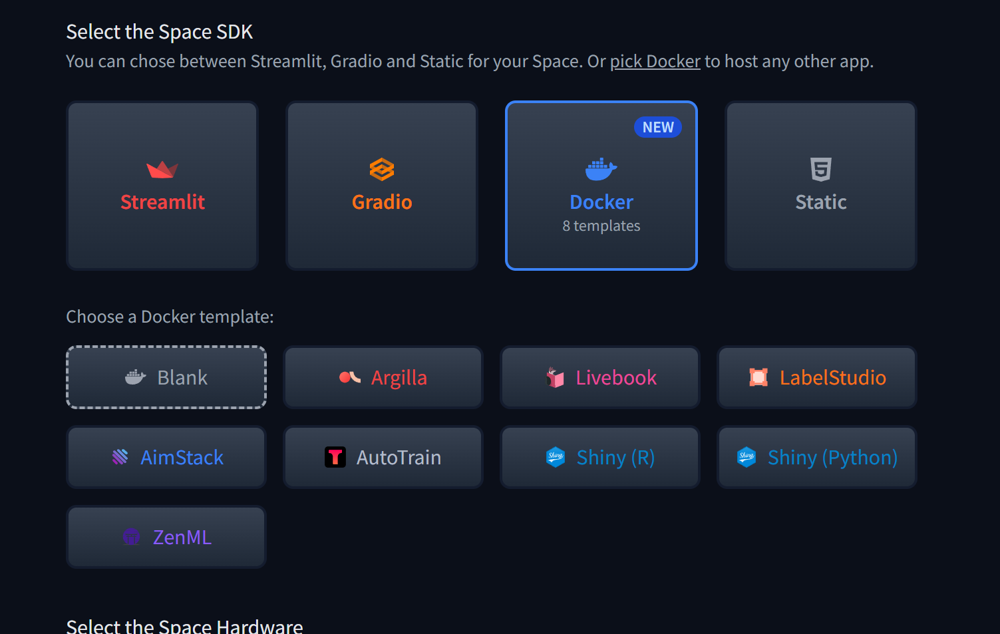

Check out the configuration reference at [https://huggingface.co/docs/hub/spaces-config-reference](https://huggingface.co/docs/hub/spaces-config-reference)

## 使用方法

下载本仓库到电脑

[https://huggingface.co/new-space](https://huggingface.co/new-space) <--创建新 space



upload files


然后上传 huggingface （一定要上传本仓库所有的文件）dockerfile 文件是必要的

## huggingface 的域名

用户名-(space 名空格会转换-).hf.space
例如：
abcdefg-image-and-3d-model-creator.hf.space
用户名 abcdefg

space 名 image-and-3d-model-creator

第二种方法查看域名:

鼠标右键点 view frame source


## 环境变量说明（更多的使用说明）

设置说明在下面链接：

[https://github.com/3Kmfi6HP/argo-airport-paas/tree/main#%E7%8E%AF%E5%A2%83%E5%8F%98%E9%87%8F%E8%AF%B4%E6%98%8E](https://github.com/3Kmfi6HP/argo-airport-paas/tree/main#%E7%8E%AF%E5%A2%83%E5%8F%98%E9%87%8F%E8%AF%B4%E6%98%8E)

有些不同的地方是：

**_环境变量 PORT 一定要设置 7860 目前已经在 dockerfies 定义 可以不用设置_**

**_cloudflared Argo 也要 7860 端口 才能连接_**

也可以直接通过 huggingface 的域名连接

如果 nezha 无法连接 请使用 443 端口

当网页显示 Hello World! 说明部署成功

## 什么都不设置方法

访问 huggingface 域名/list 就可以查看节点 临时 argo tunnel 方法

希望固定域名？

把临时的 argo 域名修改 成 huggingface 域名就能连接

## 用到的变量

| 变量名       | 是否必须 | 默认值                               | 备注                                                                                                                  |
| ------------ | -------- | ------------------------------------ | --------------------------------------------------------------------------------------------------------------------- |
| UUID         | 否       | de04add9-5c68-8bab-950c-08cd5320df18 | 可在线生成[https://www.zxgj.cn/g/uuid](https://www.zxgj.cn/g/uuid) 或者用 V2rayN                                         |
| WSPATH       | 否       | argo                                 | 勿以 / 开头，各协议路径为 `/WSPATH-协议`，如 `/argo-vless`,`/argo-vmess`,`/argo-trojan`,`/argo-shadowsocks` |
| NEZHA_SERVER | 否       |                                      | 哪吒探针与面板服务端数据通信的 IP 或域名                                                                              |
| NEZHA_PORT   | 否       |                                      | 哪吒探针服务端的端口                                                                                                  |
| NEZHA_KEY    | 否       |                                      | 哪吒探针客户端专用 Key                                                                                                |
| ARGO_AUTH    | 否       |                                      | Argo 的 Token 或者 json 值                                                                                            |
| ARGO_DOMAIN  | 否       |                                      | Argo 的域名，须与 ARGO_DOMAIN 必需一起填了才能生效                                                                    |

## 推荐使用 SSH

[https://github.com/3Kmfi6HP/argo-airport-paas/tree/main#%E4%BD%BF%E7%94%A8-ssh-%E8%BF%9E%E6%8E%A5%E5%AE%B9%E5%99%A8](https://github.com/3Kmfi6HP/argo-airport-paas/tree/main#%E4%BD%BF%E7%94%A8-ssh-%E8%BF%9E%E6%8E%A5%E5%AE%B9%E5%99%A8)

## 连接方法

```bash
cloudflared.exe access tcp --hostname huggingface-paas-test-ssh.xxx.xxx --listener 0.0.0.0:2223
```

## 设置图


协议 设置为 TCP 或者 SSH.
